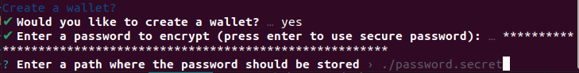
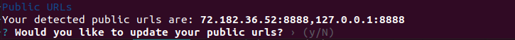
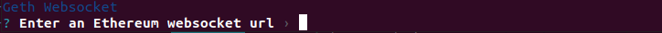
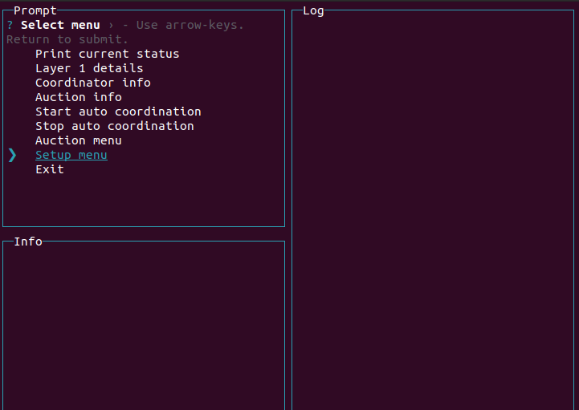
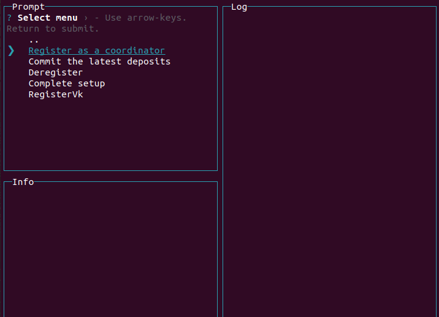

# Coordinator Setup

The Zkopru cli includes two executables: `zkopru-coordinator` and `zkopru-wallet`.

Both can be install using the following command:
```sh
npm install -g @zkopru/cli
```

Note: the Zkopru web wallet should be used instead of the command line wallet. You can access it [here](https://zkopru.network).

## Coordinator Config

Once you have installed the Zkopru cli use `zkopru-coordinator --generateConfig` to start an interactive config setup.



By default the setup will create a new Ethereum wallet and store it's password in a file in the current working directory.



The public urls need to be correct if you intend to run a staked coordinator that proposes blocks. If you are running a watcher node only these fields do not matter.



Next you need to supply an Ethereum websocket address for synchronizing the coordinator. You can supply your own or use the Zkopru node at `wss://goerli2.zkopru.network`.


Finally you need to select a data storage option. For most cases SQLite is simple and quick.

Once this is done you can run your node with the command: `zkopru-coordinator --config config.json --daemon`. The coordinator should start and begin synchronizing the layer 2 blockchain.

## Coordinator Operation

Once your coordinator is configured and operational you can run either a full coordinator or a watcher.

### Watcher

A watcher coordinator watches the layer 2 blockchain for invalid blocks and submits fraud proofs when necessary. A watcher does not need to be staked and can be operated with less Ether.

The coordinator wallet simply needs enough funds to submit a fraud proof transaction. A good amount of funds to store might be 0.5 Ether.

You can find your wallet address from the config file using the following command:

```sh
node -e "console.log('0x'+require('./config.json').keystore.address)"
```

Once your wallet is funded run a coordinator daemon like so:

```sh
zkopru-coordinator --config config.json --daemon
```

By default the daemon will submit fraud proofs whenever possible.

### Full Coordinator

A full coordinator needs to be staked in order to propose blocks. This can be done interactively by opening the coordinator user interface using the following command:

```sh
zkopru-coordinator --config config.json
```

Select the "Setup menu" option like so:



Then select `Register as a coordinator`:



This requires your wallet to have 32 Ether.

Once this is complete start your node as usual:

```sh
zkopru-coordinator --config config.json --daemon
```

#### Public URLs

Your full coordinator needs to be externally accessible for clients to submit transactions. You can update this url in the `Auction menu` in the coordinator interface, or in the `config.json`.

## Using Docker

A docker image is available at the tag `zkoprunet/coordinator:beta` containing the `zkopru-coordinator` executable. The image uses `/data` as the working directory, you can bind mount this to your local machine for storing data, config, etc. The entrypoint for this image is the `zkopru-coordinator` executable.

Use this command to generate a config and store it in the current working directory:

```sh
docker run -it --rm -v $(pwd):/data zkoprunet/coordinator:beta --generateConfig
```

Once this is done you can run like this:

```sh
docker run -it --rm -v $(pwd):/data zkoprunet/coordinator:beta --config config.json --daemon
```

A background process might be run like this:

```sh
docker run -it --rm -d --name zkopru_coordinator -v $(pwd):/data zkoprunet/coordinator:beta --config config.json --daemon
```
