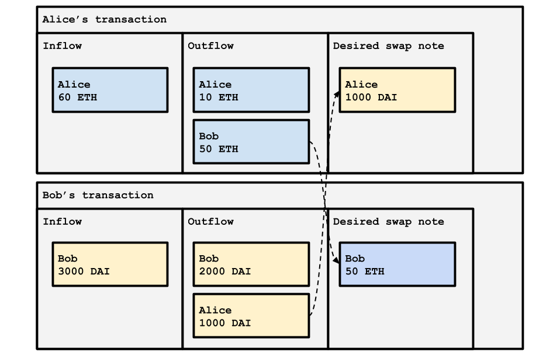

# Atomic swap

Zkopru supports the atomic swap in a straightforward way. If A and B want to swap their assets, they create notes for each other and expose the wished note on the transaction data. Then the coordinator should pair the opposite transaction or get slashed.

For example, Alice wants to swap her 50 ETH with Bob's 1000 DAI.

1. Alice spends her 60 ETH note and creates 10 ETH note for herself, and 50 ETH note for Bob.
2. Alice also calculates the hash value of her future 1000 DAI note and expose that hash value to the `swap` field of her transaction.
3. Bob also spends his 3000 DAI note and create 2000 DAI for himself and 1000 DAI note for Alice.
4. Bob also calculates the hash value of his future 50 ETH note and expose that hash value to the `swap` field of his transaction.
5. Once the coordinator matches the paired set of transactions in the transaction pool, it includes the pair into a new block.
6. If a block inclues only one of them, the coordinator will get slashed.

Zkopru is using this simple version of the atomic swap. However if you want to check an MPC based zk atomic swap model, you can check details [here](https://hackmd.io/YAr5uQ_fRYCU_ECHmcGSTw?view).

