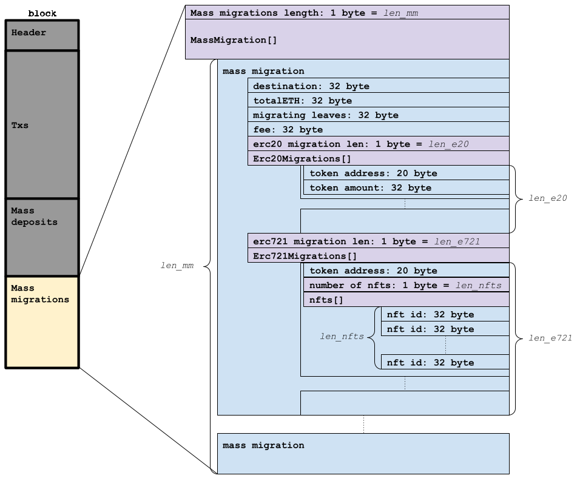

# Block structure & serailzation

A zkopru block is submitted to the layer1 in a serialized form. Then, the checksum of the proposal becomes the proposal ID and is used for the challenge system.

### Block structure

The zkopru block includes a header and a body. 

[Edit diagram here](http://www.nomnoml.com/#view/%23.right%3A%20direction%3Dright%20bold%0A%5BBlock%20%7C%0A%0A%5BHeader%20%7C%0Aproposer%0Aparent%20block%20hash%0Ametadata%0Afee%20%7C%0Autxo%20tree%20root%0Autxo%20tree%20index%0A%20%7C%0Anullifier%20tree%20root%20%7C%0Awithdrawal%20tree%20root%0Awithdrawal%20tree%20index%0A%7C%0Atx%20root%0Adeposit%20root%0Amigration%20root%0A%5D%0A%5B%3Cright%3EBody%20%7C%0A%5B%3Cright%3E%20Txs%5C%5B%5C%5D%20%7C%0A%5BTransaction%20%7C%0Ainflow%3A%20Inflow%5C%5B%5C%5D%0Aoutflow%3A%20Outflow%5C%5B%5C%5D%0Afee%3A%20uint%0Aswap%3A%20uint%0Aproof%3A%20SNARK%0Amemo%3A%20bytes%20%7C%0A%5B%3Cright%3E%20Inflow%5C%5B%5C%5D%7C%20%0A%5Binflow%201%5D%20%3C%3A--%20%5BInflow%5D%0A%5Binflow%202%5D%20%3C%3A--%20%5BInflow%5D%0A%5BInflow%20%7C%20nullifier%3A%20bytes32%3B%20reference%3A%20bytes32%5D%0A%5D%0A%5B%3Cright%3E%20Outflow%5C%5B%5C%5D%20%7C%0A%5BOutflow%201%5D%20%3C%3A--%20%5BOutflow%5D%0A%5BOutflow%202%5D%20%3C%3A--%20%5BOutflow%5D%0A%5BOutflow%203%5D%20%3C%3A--%20%5BOutflow%5D%0A%5BOutflow%202%5D%20%3C%3A--%20%5BOutflow%5D%0A%5BOutflow%20%7C%0Anote%3A%20bytes32%20%7C%0A%3Coptional%20data%3E%0Ato%0Aeth%0Atoken%0Aamount%0Anft%0Afee%0A%5D%0A%5D%0A%5BSNARK%20%7C%0A%3Cpublic%20inputs%3E%0Ainflow%0Aoutflow%0Afee%0Aswap%20%7C%0A%3Cprivate%20inputs%3E%0ADetails%20of%20spending%20notes%0AEdDSA%20signature%0AInclusion%20proof%20data%20%7C%0A%3CSNARK%20proves%3E%0A*%20Nullifier%20validity%0A*%20Zero%20sum%0A*%20EdDSA%0A*%20Inclusion%20proof%0A%5D%0A%0A%5D%0A%5BTransaction%201%5D%20%3C%3A--%20%5BTransaction%5D%0A%5BTransaction%202%5D%20%3C%3A--%20%5BTransaction%5D%0A%5BTransaction%203%5D%20%3C%3A--%20%5BTransaction%5D%0A%5BTransaction%204%5D%20%3C%3A--%20%5BTransaction%5D%0A%5BTransaction%205%5D%20%3C%3A--%20%5BTransaction%5D%0A%5BTransaction%20N%5D%20%3C%3A--%20%5BTransaction%5D%0A%5D%0A%5B%3Cright%3E%20Deposits%5C%5B%5C%5D%7C%0A%5BMassDeposit%20%7C%0AmergedLeaves%3A%20bytes32%0Afee%3A%20uint%0A%5D%0A%5Bmass%20deposit%201%5D%20%3C%3A--%20%5BMassDeposit%5D%0A%5Bmass%20deposit%202%5D%20%3C%3A--%20%5BMassDeposit%5D%0A%5Bmass%20deposit%20N%5D%20%3C%3A--%20%5BMassDeposit%5D%0A%5D%0A%5B%3Cright%3E%20Migrations%5C%5B%5C%5D%7C%0A%5Bmass%20migration%201%5D%20%3C%3A--%20%5BMassMigration%5D%0A%5Bmass%20migration%202%5D%20%3C%3A--%20%5BMassMigration%5D%0A%5Bmass%20migration%20N%5D%20%3C%3A--%20%5BMassMigration%5D%0A%5BMassMigration%20%7C%0Adestination%3A%20address%0AtotalETH%3A%20uint%0AmigratingLeaves%3A%20%7B%20mergedLeaves%2C%20%20fee%7D%0Aerc20Migrations%3A%20%7Baddress%2C%20amount%7D%5C%5B%5C%5D%0Aerc721Migrations%3A%20%7Baddress%2C%20nfts%5C%5B%5C%5D%7D%5C%5B%5C%5D%0A%5D%0A%5D%0A%5D%0A%5D%0A)

### Header

The first 372 byte of the data should be the block header. The block header contains the following data:

| Property | type |
| :--- | :--- |
| Proposer's address | address |
| Parent block hash | bytes32 |
| Metadata | uint256 |
| Fee | uint256 |
| Latest utxo tree's root | uint256 |
| Latest utxo tree's leaf index | uint256 |
| Nullifier tree's root | bytes32 |
| Latest withdrawal tree's root | uint256 |
| Latest withdrawal tree's leaf index | uint256 |
| Transactions' root | bytes32 |
| Deposits' root | bytes32 |
| Migrations' root | bytes32 |

### Body

A block body consists of transactions, mass deposits and mass migrations. And the block header should contain correct information from the body. If the header does not have a correct value, the proposer will be slashed through challenge system.

#### Transactions

#### Mass deposits

#### Mass migrations

