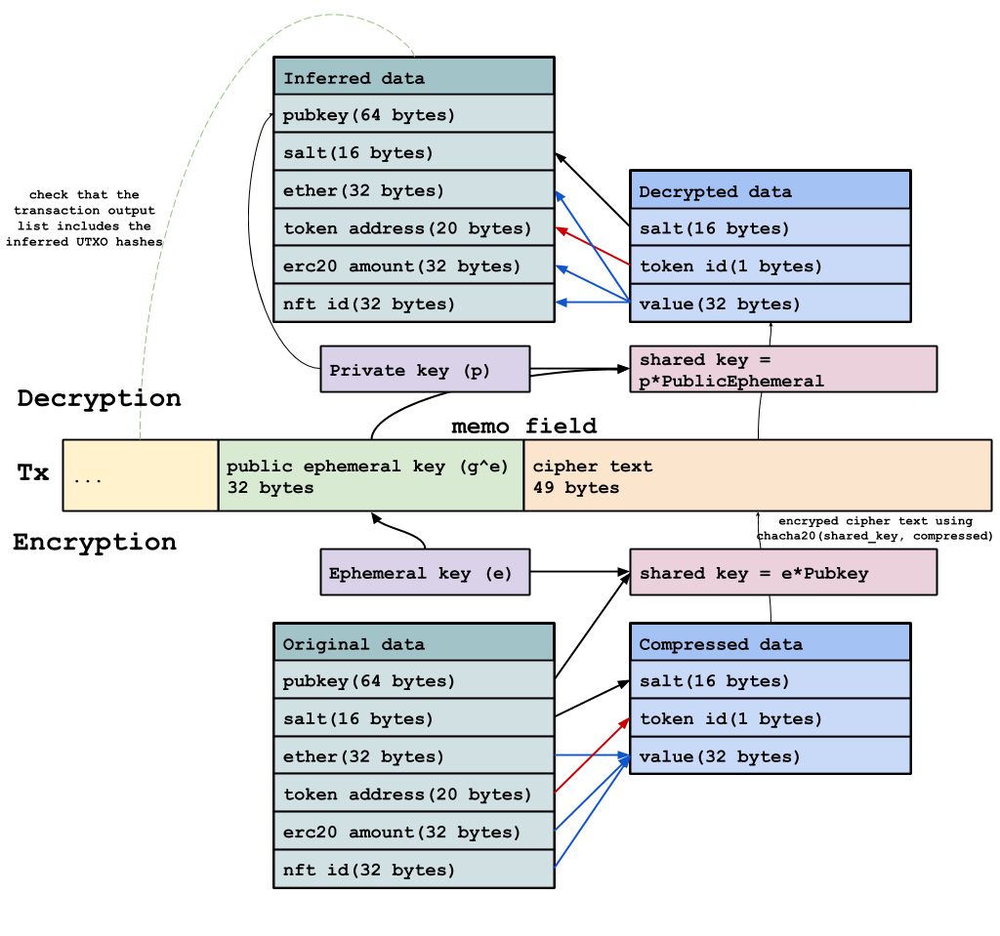

# Encrypted memo field

A zk transaction can include 81 bytes of encrypted memo field for the recipient. Because of the zero-knowledge characteristics, even the recipient cannot know the reception without an interactive process. Therefore, to keep the non-interactive way, we can put some encrypted data in the memo field for the recipient.

### Encryption

It generates the shared key using the Diffie-Hellman Key exchange protocol. The details steps to produce the shared key for the sender is:

1. Create an ephemeral key and its homomorphic hidden value.

   $$
   ephemeral = e\\
   public\_ephemeral = g^e
   $$

2. Multiply its ephemeral key to the recipient's public key

   $$
   recipient\_pubkey = g^a\\
   shared\_key = (g^a)^e
   $$

3. Prepare the compressed data to encrypt

   ```text
   data = {
       salt // 16 byte
       tokenId, // 1 byte
       value, // 32 byte
   }
   ```

4. Encrypt the data using chacha20 algorithm and create the memo data with the ephemeral public key.

   ```text
   ephemeral = random.new()
   public_ephemeral = generator.multiply(ephemeral)
   shared_key = recipient_jubjub.multiply(ephemeral)
   ciphertext = chacha20.encrypt(data, shared_key)
   memo = public_ephemeral + ciphertext
   ```

### Decryption

Using the Diffie-Hellman key exchange protocol, the recipient also creates the shared key using the public ephemeral key and the private key.

1. Parse memo and get shared key

   ```text
   public_ephemeral, ciphertext = parse(memo)
   shared_key = public_ephemeral.multiply(private_key)
   ```

2. Decrypt the ciphertext using the shared key

   ```text
   decrypted = ciphertext.decrypt(shared_key)
   ```

3. Using the decrypted result, the recipient tries to make various possible UTXOs. It is because the encrypted data has only 49 bytes to minimize the calldata size. Therefore, the recipient should try various combinations to check whether the transaction includes the recovered UTXO hashes. If it fails to find the recovered UTXOs in the tx, it considers that the tx has no output for the recipient.



### Compressed data

To minimize the calldata, Zkopru compresses original data into 49 bytes data. First of all, it gets rid of the public key from the encryption candidate because the recipient will infer that using the own public key. And it uses the Token ID, which maps the supported token addresses and the indexes from 0 to 255. And then because the `value` can be `ether`, `erc20Amount`, or `nftId`, the recipient creates three types of UTXOs for those 3 cases. Finally, if any of the inferred UTXO exists in the transaction's output list, the recipient successfully receives the UTXO.

### Limitation

Zkopru does not enforce the circuit to check the encryption protocol. Therefore, if the sender does not use an appropriate shared key or data, the recipient will not receive the note.

