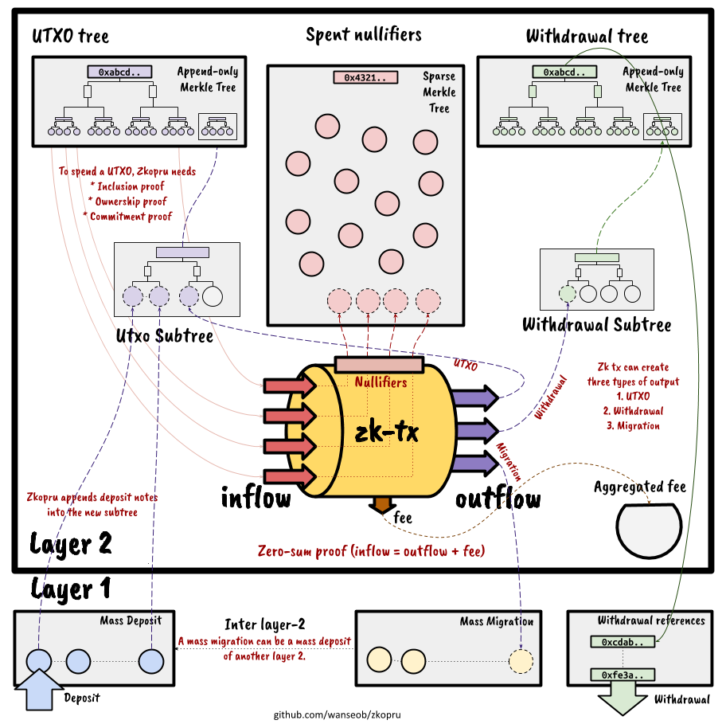

# Transaction

A zk transaction accepts several UTXOs as its inflow and creates new UTXOs for its outflow. Therefore, the most important thing is to validate the inflow and outflow.

## Inflow validation

Zkopru achieves privacy using the commitment-nullifier scheme. It means that a zk transaction spends a UTXO while not revealing which note has been used. Instead, we reveal the nullifier derived from the UTXO but not possible to link with its original UTXO.

To spend the UTXOs, it should satisfy the following conditions:

#### UTXO membership proof

The tx builder submits Merkle proofs of every UTXO to prove its existence. For an effective SNARK computation, the UTXO tree uses Poseidon for its hash function.

#### Ownership proof

Only the owner should be possible to spend the UTXO. For this condition, every note has a public key field, a Babyjubjub point. Using the paired private key, the owner can create an EdDSA signature to prove its ownership.

#### Commitment proof

The circuit should have detailed information about the input UTXOs to calculate the total sum of the inflow. Therefore, the owner should provide the details, and its Poseidon hash should equal the leaf hash of the Merkle proof and the ownership proof.

#### Nullifier proof

The given nullifiers should be correctly derived from the input UTXOs.

## Outflow validation

A zk transaction can create three types of outputs: UTXO, Withdrawal, and Migration. If the zk transaction creates UTXOs, Zkopru appends them to the UTXO tree. When it creates withdrawal outputs, Zkopru appends them to the withdrawal tree. Lastly, mass migration, which is a part of the layer-2 block, comprises the migration outputs of the block's every zk transaction.

Therefore, the outflow should satisfy the followings:

1. When the output is a UTXO type, the public hash value of the output equal the calculated in the SNARK circuit.
2. If the type of output is withdrawal or migration, it should reveal the details because it should move the correct amount of assets to the outside of the network.

## Zero-sum proof

Finally, the zk transaction should guarantee that the inflow equals the outflow, including the fee.

